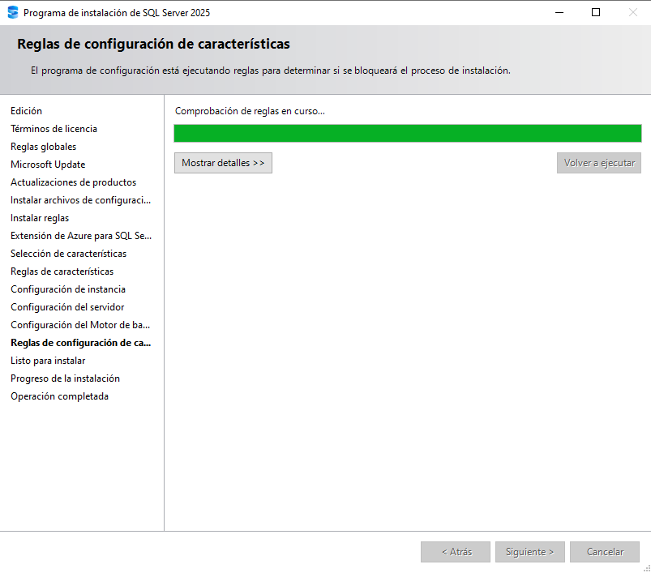
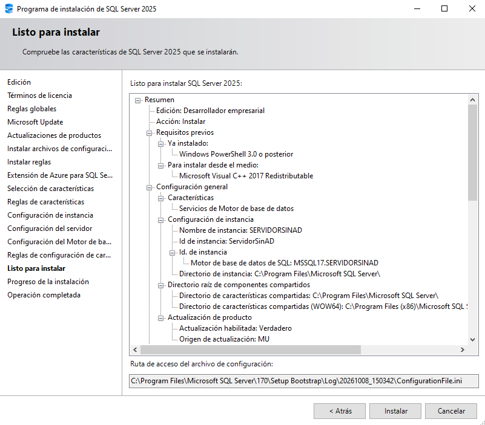

# Instalación de SQL Server 2025 Enterprise Developer

> **Estado: documentación completa hasta «Listo para instalar».** La instalación del motor y la verificación final no aparecen en las capturas y siguen sin confirmarse.

## Alcance y requisitos

- Producto: SQL Server 2025 Enterprise Developer.
- Tipo: instalación limpia del motor de base de datos en Windows.
- Topología: instancia independiente; el equipo no se une a un dominio de Active Directory como parte de este procedimiento.
- Uso: desarrollo y pruebas, fuera de producción.
- Las cuentas de servicio, la instancia, las rutas y la autenticación se decidirán según las pantallas reales, sin asumir valores de antemano.

## Procedimiento

### 1. Abrir la instalación personalizada

Ejecuta el iniciador de SQL Server 2025. En la primera pantalla aparecen Basic, Custom y Download Media; selecciona Custom para abrir el asistente detallado y revisar la configuración antes de instalar. No elijas Basic porque esta guía requiere controlar los componentes y las opciones de la instancia. El encabezado del iniciador dice “Evaluation Edition”, pero no determina la edición que se instalará; se elige en el asistente.

### 2. Elegir la ubicación de descarga

En Specify SQL Server media download target location, el idioma aparece como Spanish y la ruta propuesta es C:\\SQL2025. La pantalla indica 8752 MB de espacio libre mínimo y un tamaño de descarga de 1311 MB. Comprueba el espacio disponible y la carpeta. Pulsa Install para adquirir los archivos.

### 3. Esperar a que se adquieran los archivos

El iniciador muestra Downloading install package... y Acquiring setup files... durante la descarga. Espera a que termine la adquisición antes de continuar. La versión visible del iniciador es 17.0.1000.7.

### 4. Abrir la sección de instalación

Cuando aparezca el Centro de instalación de SQL Server, selecciona Instalación en el menú de la izquierda.

### 5. Iniciar una instalación independiente

En la página Instalación, selecciona Nueva instalación independiente de SQL Server o agregar características a una instalación existente para iniciar una instancia nueva.

### 6. Seleccionar Enterprise Developer

En Edición, cambia la selección inicial Evaluation por Enterprise Developer. La descripción del asistente indica que Developer no caduca, incluye las características de Enterprise y se licencia para desarrollo y pruebas, no para producción. Comprueba el valor antes de continuar.

### 7. Revisar y aceptar los términos de licencia

La pantalla identifica SQL Server 2025 Enterprise Developer Edition. Lee los términos y la declaración de privacidad. Acepta la casilla solo si estás de acuerdo y pulsa Siguiente.

### 8. Esperar la comprobación de reglas globales

Espera a que termine Comprobación de reglas en curso... y revisa su resultado antes de continuar.

### 9. Dejar Microsoft Update desmarcado

Deja sin marcar Usar Microsoft Update para comprobar las actualizaciones. Esta decisión omite Microsoft Update en este paso; la gestión de parches se hará después de forma controlada.

### 10. Revisar el estado de los archivos de configuración

La tabla observada mostraba Buscar actualizaciones de producto: Completado, Descargar archivos del programa de configuración: Omitido, Extraer archivos del programa de configuración: Omitido e Instalar archivos del programa de configuración: No iniciado. Conserva esos estados tal como aparecen; la comprobación de actualizaciones no demuestra que se haya instalado una actualización. Revisa la pantalla siguiente antes de avanzar.

### 11. Continuar pese a la advertencia del Firewall

El resumen observado indica 4 reglas correctas, 0 incumplidas, 1 advertencia y 0 omitidas. La advertencia corresponde a Firewall de Windows y explica que hay que abrir puertos para permitir el acceso remoto. Para esta instalación local puedes continuar sin cambiar el Firewall. No abras puertos sin necesitarlos; si posteriormente se requiere acceso remoto, configura entonces el puerto y la regla específicos.

### 12. Omitir la extensión de Azure

En Extensión de Azure para SQL Server, deja la casilla desmarcada y los campos sin completar. Esta instalación independiente no requiere conectarse a Azure. Pulsa Siguiente.

### 13. Seleccionar solo el motor de base de datos

Marca Servicios de Motor de base de datos, la característica principal del motor relacional de SQL Server. Para esta instalación limpia deja sin marcar Replication, las extensiones de lenguaje e IA, la búsqueda de texto completo, PolyBase, Analysis Services, Integration Services y las características de escalabilidad horizontal. Añádelas solo si aparece un requisito concreto. No pulses Seleccionar todo. Pulsa Siguiente y revisa la configuración de instancia y las rutas antes de continuar.

## Cierre

La guía queda finalizada y revisada hasta la pantalla **Listo para instalar**. Las capturas y las decisiones documentadas cubren el alcance de este capítulo.

## Referencias oficiales

- [Descargas de SQL Server de Microsoft](https://www.microsoft.com/es-es/sql-server/sql-server-downloads).
- [Instalar SQL Server desde el asistente gráfico](https://learn.microsoft.com/es-es/sql/database-engine/install-windows/install-sql-server-from-the-installation-wizard-setup?view=sql-server-ver17).
- [Ediciones y características de SQL Server 2025](https://learn.microsoft.com/es-es/sql/sql-server/editions-and-components-of-sql-server-2025?view=sql-server-ver17).
- [Configurar el Firewall de Windows para el acceso al motor de base de datos](https://learn.microsoft.com/en-us/sql/database-engine/configure-windows/configure-a-windows-firewall-for-database-engine-access?view=sql-server-ver17).
- [Instalar el motor de base de datos de SQL Server](https://learn.microsoft.com/en-us/sql/database-engine/install-windows/install-sql-server-database-engine?view=sql-server-ver17).

## Continuación: configuración de instancia y del motor

La secuencia completa de la guía continúa desde el paso 13. Las capturas documentan la configuración hasta **Listo para instalar**, pero no muestran el inicio ni la finalización del proceso.

### 13. Confirmar la selección del motor

La primera captura de este paso muestra la lista de características; la segunda confirma que queda seleccionado únicamente **Servicios de Motor de base de datos**. Las características opcionales permanecen desmarcadas.

### 14. Configurar una instancia con nombre

Elige **Instancia con nombre** y comprueba que el nombre y el identificador muestran `ServidorSinAD`. La ruta propuesta incluye `MSSQL17.ServidorSinAD`.

### 15. Revisar las cuentas de servicio

La captura muestra el Agente SQL Server en inicio **Manual**, el Motor de base de datos en **Automático** y SQL Server Browser **Deshabilitado**. Los nombres de las cuentas aparecen truncados. El privilegio de mantenimiento de volúmenes está desmarcado.

### 16. Añadir una cuenta administradora

El asistente no permite continuar si la lista de administradores de SQL Server está vacía. Añade una cuenta que deba administrar el motor. El aviso apareció repetido; se conserva una sola captura.

### 17. Confirmar la autenticación y los administradores del motor

En la configuración del motor se eligió el modo mixto y se añadió la cuenta local actual a la lista de administradores. Los campos de contraseña están enmascarados. La copia de la imagen publicada oculta la identidad del equipo.

### 18. Esperar la comprobación de reglas

Espera a que termine la comprobación de reglas de configuración de características y revisa su resultado antes de continuar. La captura disponible muestra el proceso en curso, no el resultado final.

### 19. Revisar el resumen antes de instalar

El resumen muestra la edición **Desarrollador empresarial**, la acción **Instalar**, el Motor de base de datos y la instancia `SERVIDORSINAD`. Revisa la configuración antes de iniciar la instalación.

El resumen indica **Actualización habilitada: Verdadero** y **Origen de actualización: MU**, aunque la casilla de Microsoft Update se dejó desmarcada anteriormente. Se registran ambos estados observados; la captura no prueba que se descargara o instalara una actualización.

## Estado final

Guía finalizada y revisada hasta **Listo para instalar**. El capítulo cubre el recorrido documentado en las capturas y queda cerrado en el resumen previo a la instalación.
